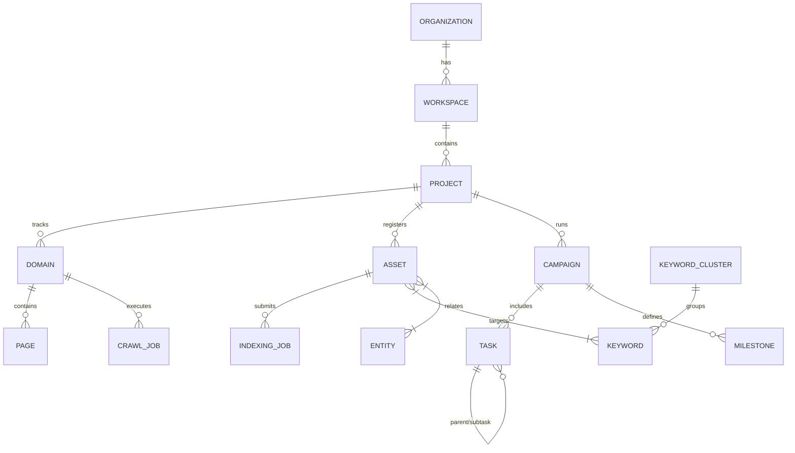

# Database Models Reference

> Complete reference for all SQLAlchemy models in Eli Claw

**Tags:** #database #models #sqlalchemy #schema

---

## Core SaaS Models

### User (`models/user.py`)
User authentication and profile management.

**Fields:**
- `id`, `email`, `hashed_password`
- `full_name`, `is_active`, `is_superuser`
- `organization_id` (FK)
- `created_at`, `updated_at`

**Relations:**
- → Organization (many-to-one)
- → Projects (many-to-many via workspace)

---

### Organization (`models/organization.py`)
Multi-tenant organization container.

**Fields:**
- `id`, `name`, `slug`
- `plan_name` (free, starter, pro, agency, enterprise)
- `subscription_status`
- `monthly_crawl_limit`, `monthly_keyword_limit`
- `monthly_ai_check_limit`, `seats_limit`
- `stripe_customer_id`
- `created_at`, `updated_at`

**Relations:**
- → Users (one-to-many)
- → Workspaces (one-to-many)

---

### Workspace (`models/workspace.py`)
Workspace within organization for project grouping.

**Fields:**
- `id`, `name`, `description`
- `organization_id` (FK)
- `settings` (JSONB)
- `created_at`, `updated_at`

**Relations:**
- → Organization (many-to-one)
- → Projects (one-to-many)

---

### Project (`models/project.py`)
Client or internal project container.

**Fields:**
- `id`, `name`, `description`
- `workspace_id` (FK)
- `industry`, `location`, `target_audience`
- `brand_entities` (JSONB)
- `status` (active, archived)
- `created_at`, `updated_at`

**Relations:**
- → Workspace (many-to-one)
- → Domains (one-to-many)
- → Campaigns (one-to-many)
- → Assets (one-to-many)

---

## SEO Intelligence Models

### Domain (`models/domain.py`)
Tracked domain for crawling and monitoring.

**Fields:**
- `id`, `domain_name`, `protocol` (http/https)
- `project_id` (FK)
- `crawl_enabled`, `last_crawled_at`
- `robots_txt_found`, `sitemap_found`
- `total_pages`, `indexed_pages`
- `health_score`
- `created_at`, `updated_at`

**Relations:**
- → Project (many-to-one)
- → Pages (one-to-many)
- → CrawlJobs (one-to-many)

---

### Page (`models/page.py`)
Individual crawled page data.

**Fields:**
- `id`, `url`, `canonical_url`
- `domain_id` (FK)
- `status_code`, `content_type`
- `title`, `meta_description`, `h1`
- `word_count`, `load_time_ms`
- `noindex`, `nofollow`
- `schema_data` (JSONB)
- `open_graph` (JSONB)
- `internal_links_in`, `internal_links_out`
- `external_links` (JSONB)
- `last_crawled_at`
- `created_at`, `updated_at`

**Relations:**
- → Domain (many-to-one)
- → Assets (one-to-one)

---

### CrawlJob (`models/crawl.py`)
Crawl execution tracking.

**Fields:**
- `id`, `domain_id` (FK)
- `status` (pending, running, completed, failed)
- `max_depth`, `max_pages`
- `respect_robots_txt`
- `pages_crawled`, `errors_count`
- `started_at`, `completed_at`
- `error_message`
- `created_at`

**Relations:**
- → Domain (many-to-one)
- → CrawlResults (one-to-many)

---

### Keyword (`models/keyword.py`)
Keyword research data.

**Fields:**
- `id`, `keyword`, `parent_topic`
- `cluster_id` (FK)
- `search_intent` (informational, commercial, transactional, navigational)
- `local_modifier`, `commercial_score`
- `difficulty_estimate`, `opportunity_score`
- `content_type_recommendation`
- `suggested_title`, `suggested_h1`
- `faq_questions` (JSONB)
- `ai_prompt_variations` (JSONB)
- `created_at`, `updated_at`

**Relations:**
- → KeywordCluster (many-to-one)
- → Projects (many-to-many)

---

### Entity (`models/entity.py`)
Entity graph nodes.

**Fields:**
- `id`, `name`, `entity_type`
- `description`, `wikipedia_url`
- `schema_org_type`
- `confidence_score`
- `metadata` (JSONB)
- `created_at`, `updated_at`

**Relations:**
- → Assets (many-to-many)
- → Keywords (many-to-many)

---

### Asset (`models/asset.py`)
Content asset registry.

**Fields:**
- `id`, `url`, `canonical_url`
- `asset_type` (page, blog, landing, pdf, video, youtube, reddit, etc.)
- `project_id` (FK)
- `topic`, `primary_keyword_id` (FK)
- `secondary_keywords` (JSONB)
- `entity_tags` (JSONB)
- `indexing_status` (draft, published, submitted, crawled, indexed, not_indexed, excluded)
- `crawl_status`, `ai_citation_status`
- `internal_links_in`, `internal_links_out`
- `schema_found`, `recommendations` (JSONB)
- `created_at`, `updated_at`, `last_crawled_at`

**Relations:**
- → Project (many-to-one)
- → Keywords (many-to-many)
- → Entities (many-to-many)
- → IndexingJobs (one-to-many)

---

### IndexingJob (`models/indexing.py`)
URL submission and discovery tracking.

**Fields:**
- `id`, `asset_id` (FK), `url`
- `project_id` (FK)
- `status` (draft, submitted, crawled, indexed, not_indexed, excluded, error)
- `submission_method` (indexnow, sitemap, rss, manual)
- `submitted_at`, `last_checked_at`
- `indexnow_response` (JSONB)
- `content_hash` (SHA-256)
- `retry_count`, `max_retries`
- `exclusion_reason`
- `created_at`, `updated_at`

**Relations:**
- → Asset (many-to-one)
- → Project (many-to-one)

---

### AICitationCheck (`models/citation.py`)
AI citation monitoring results.

**Fields:**
- `id`, `prompt_question`
- `target_brand`, `target_domain`
- `competitor_brands` (JSONB)
- `ai_system` (chatgpt, gemini, perplexity, claude, copilot)
- `answer_text` (TEXT)
- `sources_cited` (JSONB)
- `brand_mentioned`, `competitor_mentioned`
- `url_cited`, `citation_position`
- `ai_citation_score`
- `checked_at`, `created_at`

**Relations:**
- → Project (many-to-one)

---

### Recommendation (`models/recommendation.py`)
Prioritized SEO recommendations.

**Fields:**
- `id`, `project_id` (FK)
- `url`, `recommendation_type`
- `issue`, `recommendation`
- `impact` (high, medium, low)
- `effort` (high, medium, low)
- `priority_score` (0-100)
- `status` (backlog, planned, in_progress, completed)
- `category` (technical, content, linking, schema, indexing, keyword, entity, ai_citation, competitor, local, performance)
- `created_at`, `completed_at`

**Relations:**
- → Project (many-to-one)
- → Task (one-to-many)

---

### Competitor (`models/competitor.py`)
Competitor tracking.

**Fields:**
- `id`, `name`, `domain`
- `project_id` (FK)
- `market_share_estimate`
- `strengths` (JSONB)
- `weaknesses` (JSONB)
- `tracked_keywords` (JSONB)
- `last_analyzed_at`
- `created_at`, `updated_at`

**Relations:**
- → Project (many-to-one)

---

## Growth Channel Models

### ParasiteOpportunity (`models/parasite_seo.py`)
Third-party publishing opportunities.

**Fields:**
- `id`, `platform` (reddit, medium, linkedin, substack, quora, youtube, github, gbp, forum)
- `url`, `topic`
- `target_keyword`, `target_entity`
- `project_id` (FK)
- `content_type`
- `authority_score`, `relevance_score`
- `indexing_likelihood`, `risk_score`
- `publishing_status` (identified, planned, drafting, published)
- `parasite_opportunity_score` (0-100)
- `notes`, `last_checked_at`
- `created_at`, `updated_at`

**Relations:**
- → Project (many-to-one)

---

### RedditFinding (`models/reddit.py`)
Reddit research insights.

**Fields:**
- `id`, `subreddit`, `post_url`
- `post_title`, `author_handle`
- `post_date`, `topic`, `keyword`
- `intent`, `pain_point`
- `location_signal`, `service_signal`
- `client_relevance_score`
- `lead_potential_score` (0-100)
- `suggested_response_angle`
- `content_opportunity`
- `compliance_notes`
- `project_id` (FK)
- `created_at`, `updated_at`

**Relations:**
- → Project (many-to-one)

---

### YouTubeVideo (`models/youtube.py`)
YouTube SEO assets.

**Fields:**
- `id`, `video_url`, `channel_name`
- `title`, `description`, `tags` (JSONB)
- `target_keyword`, `topic_cluster`
- `related_website_page`
- `transcript` (TEXT)
- `chapters` (JSONB)
- `thumbnail_notes`
- `publish_date`
- `optimization_score` (0-100)
- `suggested_improvements` (JSONB)
- `project_id` (FK)
- `created_at`, `updated_at`

**Relations:**
- → Project (many-to-one)

---

### SocialPost (`models/social.py`)
Social media SEO assets.

**Fields:**
- `id`, `platform` (facebook, instagram, linkedin, tiktok, twitter, pinterest, reddit, youtube_shorts, gbp)
- `post_url`, `caption`
- `target_keyword`, `target_entity`
- `content_type` (post, story, reel, short, pin)
- `hashtags` (JSONB)
- `cta`, `related_website_page`
- `related_campaign`
- `publish_date`
- `repurposing_status`
- `seo_value_score` (0-100)
- `project_id` (FK)
- `created_at`, `updated_at`

**Relations:**
- → Project (many-to-one)

---

## Project Management Models

### Campaign (`models/project_management.py`)
SEO campaign container.

**Fields:**
- `id`, `name`, `description`
- `project_id` (FK)
- `campaign_type` (technical_seo, content, local, youtube, social, parasite, reddit)
- `status` (planning, active, paused, completed)
- `start_date`, `end_date`
- `budget_hours`, `spent_hours`
- `owner_id` (FK to User)
- `created_at`, `updated_at`

**Relations:**
- → Project (many-to-one)
- → Tasks (one-to-many)
- → Milestones (one-to-many)

---

### Task (`models/project_management.py`)
Actionable task.

**Fields:**
- `id`, `title`, `description`
- `campaign_id` (FK)
- `parent_task_id` (self-reference for subtasks)
- `status` (backlog, planned, in_progress, blocked, needs_review, needs_approval, approved, published, completed, archived)
- `priority` (critical, high, medium, low)
- `effort_estimate` (hours)
- `actual_effort` (hours)
- `due_date`
- `assigned_to` (FK to User)
- `dependencies` (JSONB array of task IDs)
- `deliverables` (JSONB)
- `client_approval_required`
- `client_approved`
- `created_at`, `updated_at`, `completed_at`

**Relations:**
- → Campaign (many-to-one)
- → Parent Task (many-to-one, optional)
- → Subtasks (one-to-many)
- → Assignee (many-to-one)

---

### Milestone (`models/project_management.py`)
Project milestone.

**Fields:**
- `id`, `name`, `description`
- `campaign_id` (FK)
- `due_date`
- `status` (pending, in_progress, achieved, missed)
- `completion_percentage`
- `created_at`, `updated_at`

**Relations:**
- → Campaign (many-to-one)

---

## Developer Tools Models

### RepositoryScan (`models/repositories.py`)
Public repository analysis.

**Fields:**
- `id`, `repository_name`, `owner`
- `repository_url`
- `description`, `stars`, `forks`
- `last_updated`, `primary_language`
- `license_type` (mit, apache-2.0, gpl-3.0, etc.)
- `topics` (JSONB)
- `relevant_files` (JSONB)
- `package_dependencies` (JSONB)
- `reusable_ideas` (TEXT)
- `compliance_notes`
- `repurpose_recommendation`
- `scanned_at`, `created_at`

**Relations:**
- None (standalone reference)

---

### RepurposingPlan (`models/repositories.py`)
Implementation plan from public patterns.

**Fields:**
- `id`, `repository_scan_id` (FK)
- `feature_name`, `description`
- `implementation_approach`
- `files_to_create` (JSONB)
- `files_to_modify` (JSONB)
- `attribution_required`
- `license_compatible`
- `estimated_hours`
- `priority` (high, medium, low)
- `status` (planned, in_progress, completed)
- `created_at`, `updated_at`

**Relations:**
- → RepositoryScan (many-to-one)

---

### PublicAPIConnector (`models/api_connectors.py`)
API integration registry.

**Fields:**
- `id`, `provider_name`, `base_url`
- `auth_type` (none, api_key, oauth2, bearer)
- `rate_limit_per_minute`
- `allowed_endpoints` (JSONB)
- `required_scopes` (JSONB)
- `data_type`
- `connected_project_id` (FK)
- `last_successful_request`
- `error_count`
- `compliance_notes`
- `created_at`, `updated_at`

**Relations:**
- → Project (many-to-one, optional)

---

### APIKeyStatus (`models/api_connectors.py`)
API key health monitoring (NO SECRETS STORED).

**Fields:**
- `id`, `provider_name`
- `key_name` (label only, NOT the actual key)
- `key_prefix_masked` (e.g., "sk-proj-****")
- `status` (active, inactive, expired, error)
- `last_validated_at`
- `validation_error`
- `expires_at` (optional)
- `rotation_reminder_date`
- `fallback_configured`
- `created_at`, `updated_at`

**Note:** Actual API keys are stored ONLY in environment variables or secrets manager. This table tracks metadata and health status.

**Relations:**
- None (standalone tracking)

---

## Quick Reference

### Status Enums

**Indexing Status:**
- `draft`, `published`, `submitted`, `crawled`, `indexed`, `not_indexed`, `excluded`, `duplicate`, `canonicalized`, `noindex`, `error`, `needs_improvement`

**Task Status:**
- `backlog`, `planned`, `in_progress`, `blocked`, `needs_review`, `needs_approval`, `approved`, `published`, `completed`, `archived`

**Crawl Status:**
- `pending`, `running`, `completed`, `failed`

**Recommendation Priority:**
- `critical`, `high`, `medium`, `low`

---

## Relationships Diagram

---

*See also: [[Eli_Claw_Master_Index]]*
