# Eli Claw SaaS Platform - Master Index

> **AI Search Intelligence Platform** by VirtuaLab Digital

This is the central navigation hub for the Eli Claw project. Use this file in Obsidian to navigate all modules, agents, services, and documentation.

---

## 🏗️ Architecture Overview

```mermaid
graph TD
    A[Eli Claw Platform] --> B[Core SaaS Layer]
    A --> C[SEO Intelligence]
    A --> D[AI Agent System]
    A --> E[Project Management]
    A --> F[Content & Media]
    
    B --> B1[Users & Organizations]
    B --> B2[Workspaces & Projects]
    B --> B3[Domains & Assets]
    B --> B4[Billing & Plans]
    
    C --> C1[Crawler & Audit]
    C --> C2[Keyword Research]
    C --> C3[Entity Mapping]
    C --> C4[Indexing & Discovery]
    C --> C5[AI Citation Monitor]
    
    D --> D1[CrewAI Agents]
    D --> D2[Qwen Integration]
    D --> D3[Kimi Research]
    D --> D4[OpenClaw Orchestration]
    
    E --> E1[Campaigns]
    E --> E2[Tasks & Subtasks]
    E --> E3[Milestones]
    E --> E4[Client Reporting]
    
    F --> F1[YouTube SEO]
    F --> F2[Social SEO]
    F --> F3[Parasite SEO]
    F --> F4[Content Briefs]
```



---

## 📁 Project Structure

```
Eli-Swarm-Claw/
├── apps/
│   ├── api/                    # FastAPI Backend
│   │   ├── app/
│   │   │   ├── api/           # REST Endpoints
│   │   │   ├── core/          # Config, Security, DB
│   │   │   ├── models/        # SQLAlchemy Models
│   │   │   ├── schemas/       # Pydantic Schemas
│   │   │   ├── services/      # Business Logic
│   │   │   └── agents/        # CrewAI Agents
│   │   └── Dockerfile
│   └── web/                    # Next.js Dashboard (placeholder)
├── docs/                       # Documentation
├── infra/                      # Docker & DevOps
├── scripts/                    # Seed & Utility Scripts
└── .github/workflows/          # CI/CD
```

---

## 🔗 Quick Navigation

### Core Documentation
- [[README]] - Main project overview
- [[AGENTS]] - Complete agent specifications
- [[SAFETY_AND_COMPLIANCE]] - Ethical guidelines
- [[REPOSITORY_REPURPOSING]] - Open-source integration guide
- [[INDEXING_GUIDE]] - Indexing API documentation
- [[INDEXING_IMPLEMENTATION_SUMMARY]] - Indexing examples

### Database Models
- [[models/user]] - User authentication & profiles
- [[models/organization]] - Multi-tenant organizations
- [[models/workspace]] - Workspace containers
- [[models/project]] - Client projects
- [[models/domain]] - Domain tracking
- [[models/page]] - Crawled pages
- [[models/crawl]] - Crawl jobs & results
- [[models/keyword]] - Keywords & clusters
- [[models/entity]] - Entity graph
- [[models/asset]] - Asset registry
- [[models/indexing]] - Indexing jobs
- [[models/citation]] - AI citation checks
- [[models/recommendation]] - SEO recommendations
- [[models/competitor]] - Competitor tracking
- [[models/project_management]] - Campaigns, tasks, milestones
- [[models/parasite_seo]] - Parasite opportunities
- [[models/reddit]] - Reddit research findings
- [[models/youtube]] - YouTube video assets
- [[models/social]] - Social media posts
- [[models/repositories]] - Repository scans
- [[models/api_connectors]] - API integrations

### API Endpoints
- [[api/projects]] - Project CRUD operations
- [[api/domains]] - Domain management
- [[api/crawl]] - Crawl job control
- [[api/audit]] - Technical SEO analysis
- [[api/keywords]] - Keyword research
- [[api/entities]] - Entity extraction
- [[api/indexing]] - URL submission & sitemaps
- [[api/citations]] - AI citation monitoring
- [[api/recommendations]] - Prioritized actions
- [[api/reports]] - Dashboard exports

### Services
- [[services/indexing]] - IndexNow, sitemaps, indexability checks

---

## 🤖 Agent System (18 Agents)

| Agent | Purpose | Status |
|-------|---------|--------|
| [[agent-crawler]] | Runs crawls, extracts signals | 🟡 Planned |
| [[agent-seo-auditor]] | Reviews crawl results | 🟡 Planned |
| [[agent-keyword]] | Expands & clusters keywords | 🟡 Planned |
| [[agent-entity]] | Maps entities & topics | 🟡 Planned |
| [[agent-competitor]] | Analyzes competitor gaps | 🟡 Planned |
| [[agent-indexing]] | Manages discovery workflows | 🟢 Implemented |
| [[agent-content-brief]] | Generates SEO briefs | 🟡 Planned |
| [[agent-citation]] | Monitors AI citations | 🟡 Planned |
| [[agent-qa]] | Validates data quality | 🟡 Planned |
| [[agent-report]] | Creates client reports | 🟡 Planned |
| [[agent-parasite-seo]] | Finds third-party opportunities | 🟡 Planned |
| [[agent-reddit-research]] | Mines Reddit insights | 🟡 Planned |
| [[agent-reddit-lead]] | Identifies lead signals | 🟡 Planned |
| [[agent-project-manager]] | Converts strategy to tasks | 🟡 Planned |
| [[agent-api-steward]] | Monitors API key health | 🟡 Planned |
| [[agent-visual-builder]] | Creates wireframes | 🟡 Planned |
| [[agent-web-dev]] | Implements frontend code | 🟡 Planned |
| [[agent-youtube-seo]] | Optimizes video assets | 🟡 Planned |
| [[agent-social-seo]] | Optimizes social posts | 🟡 Planned |
| [[agent-repository-scout]] | Finds open-source patterns | 🟡 Planned |
| [[agent-repurposing]] | Converts patterns to plans | 🟡 Planned |

**Legend:** 🟢 Implemented | 🟡 Planned | 🔴 Not Started

---

## 📊 SaaS Modules

### 1. Core SaaS Layer
- ✅ Multi-tenant architecture
- ✅ Organization → Workspace → Project hierarchy
- ✅ User roles & permissions
- ✅ Subscription tracking (plans, limits, credits)
- ✅ Billing placeholders (Stripe-ready)

### 2. SEO Intelligence
- ✅ Technical crawler (robots.txt compliant)
- ✅ Site audit engine
- ✅ Keyword research & clustering
- ✅ Entity & topic graph
- ✅ Asset registry (all content types)
- ✅ Indexing & discovery workflow
- ✅ AI citation monitoring

### 3. Growth Channels
- ✅ Parasite SEO strategist
- ✅ Reddit deep research
- ✅ YouTube SEO optimizer
- ✅ Social media SEO
- ✅ Content brief generator

### 4. Project Management
- ✅ Campaigns & milestones
- ✅ Tasks & subtasks
- ✅ Priority scoring
- ✅ Client approvals workflow
- ✅ Sprint planning

### 5. Developer Tools
- ✅ Public repository scanner
- ✅ Repurposing engine
- ✅ API connector registry
- ✅ API key health monitor

---

## 🚀 Getting Started

### Prerequisites
- Docker & Docker Compose
- Python 3.10+
- PostgreSQL 14+
- Redis (optional for queues)

### Quick Start
```bash
# 1. Clone repository
git clone https://github.com/AISEO-VirtualabDigital/Eli-Swarm-Claw.git
cd Eli-Swarm-Claw

# 2. Setup environment
cp .env.example .env
# Edit .env with your configuration

# 3. Start infrastructure
cd infra && docker-compose up -d

# 4. Seed database
cd .. && python scripts/seed.py

# 5. Run API server
cd apps/api && uvicorn app.api.main:app --reload --host 0.0.0.0 --port 8000

# 6. Open API docs
open http://localhost:8000/docs
```

### Test Endpoints
```bash
# Health check
curl http://localhost:8000/api/v1/health

# Submit URL for indexing
curl -X POST http://localhost:8000/api/v1/indexing/submit \
  -H "Content-Type: application/json" \
  -d '{"url":"https://example.com/test","project_id":1}'

# Get crawl status
curl http://localhost:8000/api/v1/crawl/jobs
```

---

## 🎯 Feature Matrix

| Feature | Status | API | Docs | Tests |
|---------|--------|-----|------|-------|
| User Management | ✅ Complete | ✅ | ✅ | 🟡 TODO |
| Organizations | ✅ Complete | ✅ | ✅ | 🟡 TODO |
| Projects | ✅ Complete | ✅ | ✅ | 🟡 TODO |
| Domain Tracking | ✅ Complete | ✅ | ✅ | 🟡 TODO |
| Crawler | 🟡 Partial | ✅ | ✅ | 🟡 TODO |
| Technical Audit | 🟡 Partial | ✅ | ✅ | 🟡 TODO |
| Keyword Research | 🟡 Partial | ✅ | ✅ | 🟡 TODO |
| Entity Mapping | 🟡 Partial | ✅ | ✅ | 🟡 TODO |
| Asset Registry | ✅ Complete | ✅ | ✅ | 🟡 TODO |
| Indexing Workflow | ✅ Complete | ✅ | ✅ | 🟡 TODO |
| AI Citations | 🟡 Partial | ✅ | ✅ | 🟡 TODO |
| Recommendations | ✅ Complete | ✅ | ✅ | 🟡 TODO |
| Reports | 🟡 Partial | ✅ | ✅ | 🟡 TODO |
| Project Management | ✅ Complete | 🟡 TODO | 🟡 TODO | 🔴 TODO |
| Parasite SEO | ✅ Complete | 🟡 TODO | 🟡 TODO | 🔴 TODO |
| Reddit Research | ✅ Complete | 🟡 TODO | 🟡 TODO | 🔴 TODO |
| YouTube SEO | ✅ Complete | 🟡 TODO | 🟡 TODO | 🔴 TODO |
| Social SEO | ✅ Complete | 🟡 TODO | 🟡 TODO | 🔴 TODO |
| Repository Scanner | ✅ Complete | 🟡 TODO | ✅ | 🔴 TODO |
| API Connectors | ✅ Complete | 🟡 TODO | 🟡 TODO | 🔴 TODO |
| CrewAI Agents | 🟡 Planned | 🔴 TODO | ✅ | 🔴 TODO |

**Legend:** ✅ Complete | 🟡 Partial/Planned | 🔴 Not Started

---

## 📈 Roadmap

### Phase 1: Foundation (Current)
- [x] Database models
- [x] API structure
- [x] Core services
- [x] Documentation
- [ ] Unit tests
- [ ] Integration tests

### Phase 2: Agent Integration
- [ ] CrewAI setup
- [ ] Agent implementations
- [ ] Task orchestration
- [ ] Queue system (Redis)

### Phase 3: Dashboard
- [ ] Next.js app
- [ ] Authentication UI
- [ ] Dashboard components
- [ ] Real-time updates

### Phase 4: External Integrations
- [ ] Google Search Console
- [ ] IndexNow API
- [ ] Third-party keyword APIs
- [ ] PageSpeed Insights

### Phase 5: Production
- [ ] CI/CD pipelines
- [ ] Monitoring & logging
- [ ] Rate limiting
- [ ] Multi-region deployment

---

## 🔐 Security & Compliance

- ✅ SSRF protection enabled
- ✅ No credential storage
- ✅ Robots.txt respect
- ✅ Rate limiting built-in
- ✅ License compliance tracking
- ✅ Ethical guidelines documented
- ✅ No spam automation
- ✅ No black-hat techniques

See: [[SAFETY_AND_COMPLIANCE]]

---

## 📚 Related Resources

- **FastAPI Docs**: https://fastapi.tiangolo.com
- **SQLAlchemy**: https://www.sqlalchemy.org
- **Pydantic**: https://docs.pydantic.dev
- **CrewAI**: https://www.crewai.com
- **IndexNow**: https://www.indexnow.org
- **Obsidian**: https://obsidian.md

---

## 🏷️ Tags

#elixir-claw #saas #seo #ai-agents #fastapi #python #postgresql #docker #crewai #technical-seo #keyword-research #entity-seo #indexing #ai-citations #project-management #reddit-research #youtube-seo #social-seo #parasite-seo #repository-scanner

---

*Last updated: {{date}}*
*Version: 1.0.0*
