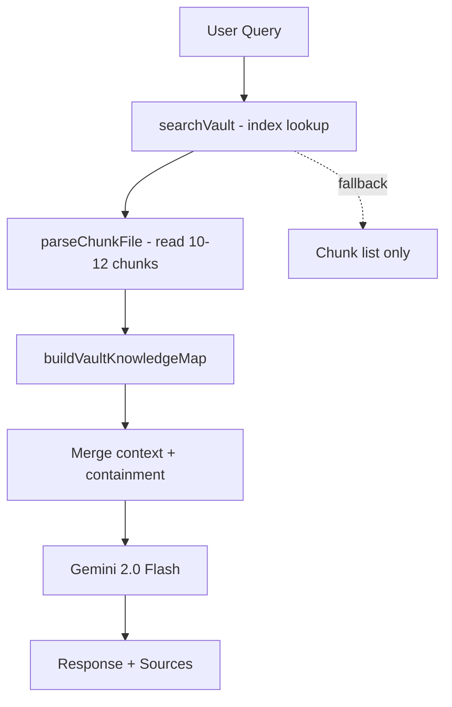

# Air LLM Pipeline

> Lightweight Gemini-powered retrieval + generation

## Concept

"Air" = no heavy infrastructure. Air LLM is a thin layer that:
1. Retrieves relevant micro-chunks from the vault
2. Builds a compact, chunk-aware prompt
3. Calls Google Gemini for generation
4. Returns response with full source tracking

## Pipeline

## Configuration

| Variable | Required | Description |
|----------|----------|-------------|
| `GEMINI_API_KEY` | Yes | Google AI Studio API key |
| `OBSIDIAN_VAULT_PATH` | No | Falls back to `data/eli-vault` |

## Fallback Behavior

When Gemini is unavailable:
- Returns chunk source list instead of generated response
- Includes containment hits from dissolved knowledge
- Preserves all source tracking

## Containment Integration

Air LLM checks the containment layer (dissolved chunks) for additional context.
These are marked as `[CONTAINMENT]` in the prompt so Gemini knows they're
pattern memories from previously deleted/updated knowledge.

## Related

- [[Eli-System-Architecture]]
- [[Skill-Contain-System]]
- [[Sync-Setup]]
